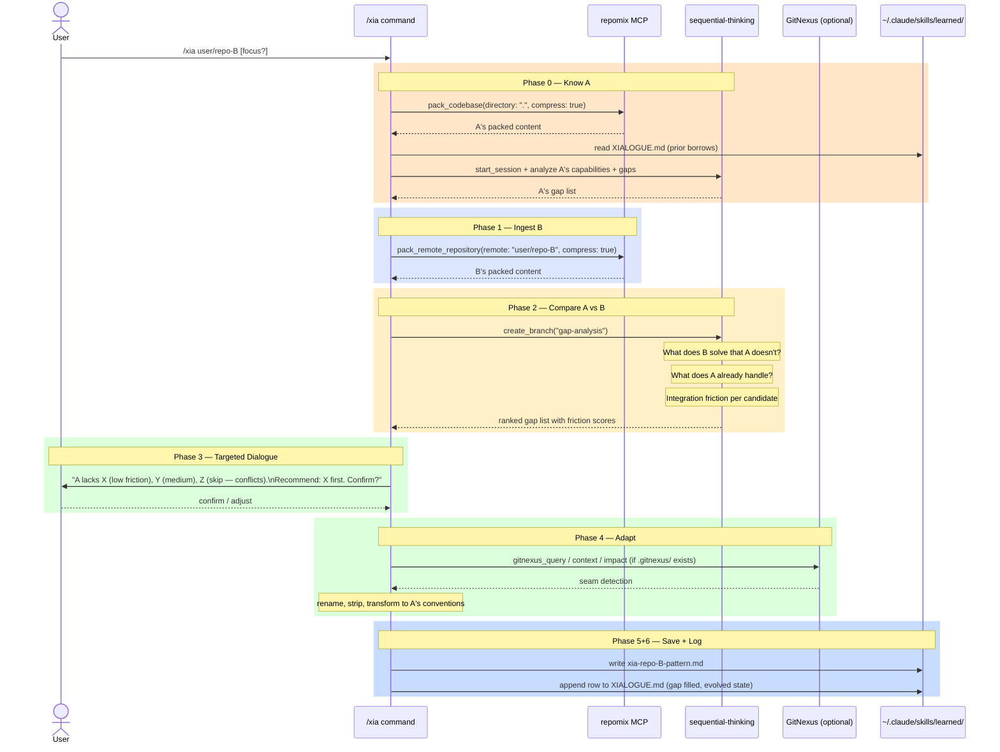

# 11-xia — Xỉa Workflow

**Xỉa** (Vietnamese): to borrow/take something from others and use it in your own product.

The `/xia` command implements a **comparative borrowing** strategy for learning from GitHub projects. This folder documents the design, workflow, and Claude Code config for the Xỉa system.

---

## The Core Idea

Xỉa is not random copying. It is intentional, **comparative extraction**:

1. You have codebase **A** (your own project, however incomplete)
2. You find project **B** on GitHub that solves something better
3. You compare A vs B to identify **gaps** — what A lacks that B handles well
4. You extract the valuable part and adapt it into A → **AB**
5. Repeat with C, D... → **ABC**, **ABCD**

Each Xỉa session makes A more complete. The XIALOGUE.md log tracks the evolution.

---

## Design Concerns (How We Got Here)

### Problem with naive borrowing

A simple "analyze B and pick something" approach is **B-centric** — it finds what's interesting in B without knowing what A needs. You end up borrowing things that A already handles, or missing the most valuable gap.

### The comparative model

The full workflow needs **two sides**:

| Side | Phases | Tools |
|------|--------|-------|
| Know A | Phase 0 | `repomix.pack_codebase`, `sequential-thinking`, `XIALOGUE.md` |
| Ingest B | Phase 1 | `repomix.pack_remote_repository` |
| Compare | Phase 2 | `sequential-thinking` gap-analysis branch |
| Extract | Phase 3-4 | Dialogue + GitNexus (optional, seam detection) |
| Save | Phase 5-6 | `~/.claude/skills/learned/`, `XIALOGUE.md` |

### Why GitNexus is optional, not required

GitNexus indexes **local** codebases via AST. It cannot reach remote repos. So:

- Phases 0-3 (foreign repo side): GitNexus is irrelevant
- Phase 4 (adapt into A): GitNexus is a useful **seam detector** — finds where the borrowed pattern attaches in A's call graph
- Without GitNexus: seam detection is done manually from the Phase 0 packed output

`/xia` is portable (works without GitNexus) but rewards users who have it set up.

### The XIALOGUE.md evolution log

Each Xỉa session appends a row to `~/.claude/XIALOGUE.md`. This log is A's **lineage record** — when Phase 0 runs in a future session, it reads this log to understand A's **current evolved state** (A + all prior borrows), not just the original codebase.

Without this log, each session starts from scratch. With it, the chain builds:

```
Session 1: /xia repo-B  → A gains hook system    → log: A→AB
Session 2: /xia repo-C  → AB gains retry logic   → log: AB→ABC
Session 3: /xia repo-D  → ABC gains memory       → log: ABC→ABCD
```

---

## Sequence Diagrams

### Current workflow (Phase 0 + comparative)



---

## Files

```
11-xia/
├── README.md              ← This file — design, concerns, diagrams
└── .claude/
    └── commands/
        └── xia.md         ← The /xia slash command (copy of ~/.claude/commands/xia.md)
```

The authoritative copy of the command lives at `~/.claude/commands/xia.md`. The copy here is for reference and sync with `claude-dotfiles`.

---

## Related Files

| File | Purpose |
|------|---------|
| `~/.claude/commands/xia.md` | The live slash command |
| `~/.claude/XIALOGUE.md` | Evolution log — all prior Xỉa sessions |
| `~/.claude/skills/learned/xia-*.md` | Extracted patterns from Xỉa sessions |
