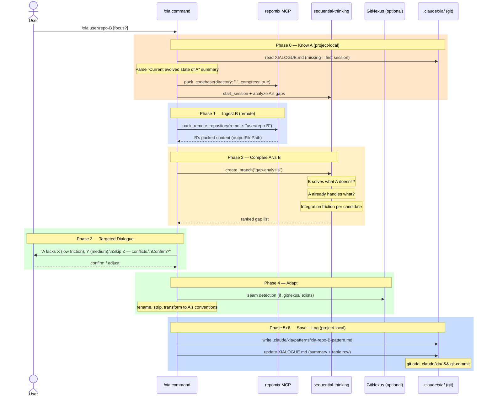

# 11-xia — Xỉa Workflow

**Xỉa** (Vietnamese): to borrow/take something from others and use it in your own product.

The `/xia` command implements a **comparative borrowing** strategy for learning from GitHub projects. This folder documents the design, workflow, and conventions for the Xỉa system.

---

## The Core Idea

Xỉa is not random copying. It is intentional, **comparative extraction**:

1. You have codebase **A** (your own project, however incomplete)
2. You find project **B** on GitHub that solves something better
3. You compare A vs B to identify **gaps** — what A lacks that B handles well
4. You extract the valuable part and adapt it into A → **AB**
5. Repeat with C, D... → **ABC**, **ABCD**

Each Xỉa session makes A more complete. The XIALOGUE.md log tracks the evolution.

---

## Storage Convention

Xỉa state is **project-local** and **committed to git**:

```
<project-root>/
└── .claude/
    └── xia/
        ├── XIALOGUE.md        ← evolution log (committed to git)
        └── patterns/
            └── xia-repo-B-pattern.md
```

**Why not `~/.claude`?**

`~/.claude` is machine-local and not in git. Saving Xỉa state there means:
- All projects share the same log (mixed up)
- State disappears when you move to another PC
- No versioning, no history

`.claude/xia/` travels with the repo: `git clone` on any machine and the full Xỉa history is immediately available. Phase 0 of `/xia` reads `.claude/xia/XIALOGUE.md` to understand the current evolved state of A before comparing with B.

---

## XIALOGUE.md Format

The critical field is the **"Current evolved state of A"** summary at the top:

```markdown
# XIALOGUE — Project Name

## Current evolved state of A

[One paragraph describing what A currently does and what it has already borrowed.
Phase 0 reads this to understand where A is NOW — not the raw original codebase.]

---

## Borrow history

| Date | Source repo | Pattern | Gap filled | Saved to |
|------|-------------|---------|------------|----------|
| 2026-03-22 | yamadashy/repomix | Token-aware compression | A had no context budget control | .claude/xia/patterns/xia-repomix-compression.md |
```

After every Xỉa session, Claude updates the prose summary AND appends a table row.

---

## Multi-PC Workflow

```
Machine 1: /xia user/repo-B
           → .claude/xia/XIALOGUE.md updated
           → git commit + push

Machine 2: git pull
           → .claude/xia/XIALOGUE.md present
           → /xia user/repo-C
           → Phase 0 reads XIALOGUE.md → knows A is already "AB"
           → compares AB vs C, not A vs C
```

No global state. No `~/.claude` dependency.

---

## Design Concerns (How We Got Here)

### Problem 1 — Wrong storage layer (v1 design)

The first version saved to `~/.claude/skills/learned/` and `~/.claude/XIALOGUE.md`. This was wrong because:
- Machine-local, not portable across PCs
- Mixed all projects into one global log
- No git history

### Problem 2 — B-centric analysis (v0 design)

The original design analyzed B and asked "what do you want to take?" — no awareness of A. This meant borrowing things A already had, or missing the most valuable gaps.

### The comparative model (current design)

Phase 0 reads the project-local XIALOGUE.md to understand A's evolved state, then Phase 2 runs a gap analysis comparing A vs B. The dialogue in Phase 3 presents gaps, not features.

### Why GitNexus is optional, not required

GitNexus indexes local codebases via AST. It cannot reach remote repos. So:
- Phases 0-3 (foreign repo side): GitNexus is irrelevant
- Phase 4 (adapt into A): GitNexus is a useful seam detector — finds where borrowed pattern attaches in A's call graph

`/xia` is portable without GitNexus, better with it.

---

## Sequence Diagram



---

## Files in This Folder

```
11-xia/
├── README.md                        ← This file
└── .claude/
    ├── commands/
    │   └── xia.md                   ← Reference copy of /xia command
    └── xia/                         ← Demo of the per-project convention
        ├── XIALOGUE.md              ← Template (copy to your project's .claude/xia/)
        └── patterns/
            └── .gitkeep
```

The authoritative command lives at `~/.claude/commands/xia.md`.
The `.claude/xia/` folder here is a **template** — copy it to the root of any project to start Xỉa-ing.

---

## Related Files

| File | Purpose |
|------|---------|
| `~/.claude/commands/xia.md` | The live slash command |
| `~/.claude/skills/learned/` | Optional: cross-project generic patterns only |
| `<project>/.claude/xia/XIALOGUE.md` | Per-project evolution log |
| `<project>/.claude/xia/patterns/` | Per-project borrowed patterns |
