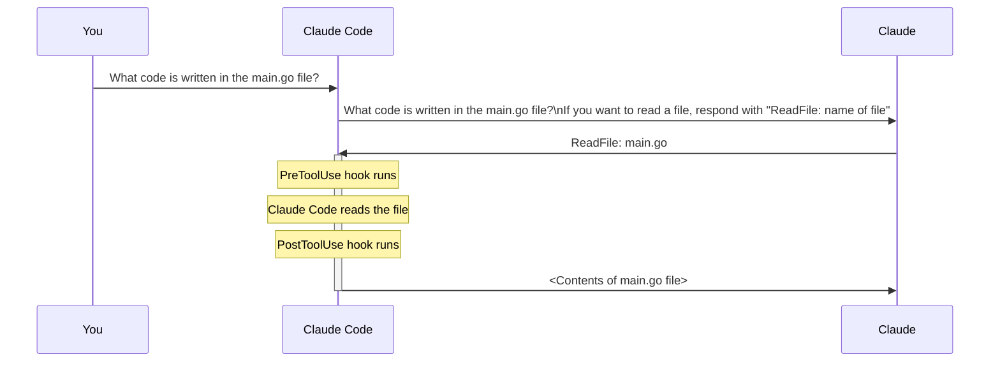

# Hooks

Hooks allow you to run commands before or after Claude attempts to run a tool. They're incredibly useful for implementing automated workflows like running code formatters after file edits, executing tests when files change, or blocking access to specific files.

## How Hooks Work
To understand hooks, let's first review the normal flow when you interact with Claude Code. When you ask Claude something, your query gets sent to the Claude model along with tool definitions. Claude might decide to use a tool by providing a formatted response, and then Claude Code executes that tool and returns the result.

Hooks insert themselves into this process, allowing you to execute code just before or just after the tool execution happens.



There are two types of hooks:

- PreToolUse hooks - Run before a tool is called
- PostToolUse hooks - Run after a tool is called

## Hook Configuration
Hooks are defined in Claude settings files. You can add them to:

- Global - ~/.claude/settings.json (affects all projects)
- Project - .claude/settings.json (shared with team)
- Project (not committed) - .claude/settings.local.json (personal settings)
You can write hooks by hand in these files or use the /hooks command inside Claude Code.


The configuration structure includes two main sections:

### Hook Definitions

**Defined in...**

| Scope                | File Path                     |
|----------------------|-------------------------------|
| Global               | `~/.claude/settings.json`     |
| Project              | `.claude/settings.json`       |
| Project (not committed) | `.claude/settings.local.json` |

**Write by hand or by using the `/hooks` command**

```json
{
  "hooks": {
    "PreToolUse": [
      {
        "matcher": "Read",
        "hooks": [
          {
            "type": "command",
            "command": "node /home/hooks/read_hook.ts"
          }
        ]
      }
    ],
    "PostToolUse": [
      {
        "matcher": "Write|Edit|MultiEdit",
        "hooks": [
          {
            "type": "command",
            "command": "node /home/hooks/edit_hook.ts"
          }
        ]
      }
    ]
  }
}
```

## PreToolUse Hooks
PreToolUse hooks run before a tool is executed. They include a matcher that specifies which tool types to target:
```
"PreToolUse": [
  {
    "matcher": "Read",
    "hooks": [
      {
        "type": "command",
        "command": "node /home/hooks/read_hook.ts"
      }
    ]
  }
]
```
Before the 'Read' tool is executed, this configuration runs the specified command. Your command receives details about the tool call Claude wants to make, and you can:

- Allow the operation to proceed normally
- Block the tool call and send an error message back to Claude
## PostToolUse Hooks
PostToolUse hooks run after a tool has been executed. Here's an example that triggers after write, edit, or multi-edit operations:

```
"PostToolUse": [
  {
    "matcher": "Write|Edit|MultiEdit",
    "hooks": [
      {
        "type": "command", 
        "command": "node /home/hooks/edit_hook.ts"
      }
    ]
  }
]
```
Since the tool call has already occurred, PostToolUse hooks can't block the operation. However, they can:

- Run follow-up operations (like formatting a file that was just edited)
- Provide additional feedback to Claude about the tool use

         ┌───────────────────────┐
         │  PreToolUse hook runs │
         └───────────────────────┘
                 │
                 ▼
   ┌───────────────────────────────────────────────────────┐
   │ • Runs a command you provide                          │
   │ • Your command can block the tool call,               │
   │   sending an error message back to Claude             │
   └───────────────────────────────────────────────────────┘
                 │
                 │  (dashed vertical line)
                 │
                 ▼
         ┌───────────────────────────────┐
         │ Claude Code reads the file    │
         └───────────────────────────────┘
                 │
                 ▼
         ┌───────────────────────┐
         │ PostToolUse hook runs │
         └───────────────────────┘
                 │
                 ▼
   ┌───────────────────────────────────────────────────────┐
   │ • Runs a command you provide                          │
   │ • Too late to block the call! But you can             │
   │   provide additional feedback to Claude               │
   └───────────────────────────────────────────────────────┘

## Practical Applications
Here are some common ways to use hooks:

- Code formatting - Automatically format files after Claude edits them
- Testing - Run tests automatically when files are changed
- Access control - Block Claude from reading or editing specific files
- Code quality - Run linters or type checkers and provide feedback to Claude
- Logging - Track what files Claude accesses or modifies
- Validation - Check naming conventions or coding standards

The key insight is that hooks let you extend Claude Code's capabilities by integrating your own tools and processes into the workflow. PreToolUse hooks give you control over what Claude can do, while PostToolUse hooks let you enhance what Claude has done.

-----------------------------
-----------------------------

Hooks in Claude Code allow you to intercept and control tool calls before or after they execute. This gives you fine-grained control over what Claude can and cannot do in your development environment.

## Building a Hook
Creating a hook involves four main steps:

         ┌───────────────────────────────┐
         │        Building a Hook        │
         └───────────────────────────────┘

   1.  ┌───────────────────────────────────────────────┐
       │ Decide on a PreToolUse or PostToolUse hook    │
       └───────────────────────────────────────────────┘

   2.  ┌───────────────────────────────────────────────┐
       │ Determine which type of tool calls you want   │
       │ to watch for                                  │
       └───────────────────────────────────────────────┘

   3.  ┌───────────────────────────────────────────────┐
       │ Write a command that will receive the tool call │
       └───────────────────────────────────────────────┘

   4.  ┌───────────────────────────────────────────────┐
       │ If needed, should provide feedback    │
       │ to Claude                                     │
       └───────────────────────────────────────────────┘
                 │
                 │  (dashed vertical line)
                 │
                 ▼
   ┌───────────────────────┐     ┌───────────────┐
   │   Claude Code         │     │   Claude      │
   └───────────────────────┘     └───────────────┘
                 │                     ▲
                 │                     │
                 └───── Read: .env ──────┘
                         │
                         ▼
           ┌───────────────────────────────┐
           │     PreToolUse hook runs      │  ← brown
           └───────────────────────────────┘
                         │
                         ▼
           ┌───────────────────────────────┐
           │ Claude Code reads the file    │  ← beige
           └───────────────────────────────┘
                         │
                         ▼
           ┌───────────────────────────────┐
           │     PostToolUse hook runs     │  ← brown
           └───────────────────────────────┘

- Decide on a PreToolUse or PostToolUse hook - PreToolUse hooks can prevent tool calls from executing, while PostToolUse hooks run after the tool has already been used
- Determine which type of tool calls you want to watch for - You need to specify exactly which tools should trigger your hook
- Write a command that will receive the tool call - This command gets JSON data about the proposed tool call via standard input
- If needed, command should provide feedback to Claude - Your command's exit code tells Claude whether to allow or block the operation
## Available Tools
Claude Code provides several built-in tools that you can monitor with hooks:

         ┌───────────────────────────────┐
         │        Building a Hook        │
         └───────────────────────────────┘

   1.  ┌───────────────────────────────────────────────┐
       │ Decide on a PreToolUse or PostToolUse hook    │
       └───────────────────────────────────────────────┘

   2.  ┌───────────────────────────────────────────────┐
       │ Determine which type of tool calls you want   │
       │ to watch for                                  │
       └───────────────────────────────────────────────┘

   3.  ┌───────────────────────────────────────────────┐
       │ Write a command that will receive the tool call │
       └───────────────────────────────────────────────┘

   4.  ┌───────────────────────────────────────────────┐
       │ If needed, command should provide feedback    │
       │ to Claude                                     │
       └───────────────────────────────────────────────┘


   ┌───────────────────────────────────────────────┐
   │                Tool Names                     │
   └───────────────────────────────────────────────┘
   ┌──────────────────────┬───────────────────────────────────────────────┐
   │ Tool Name            │ Purpose                                       │
   ├──────────────────────┼───────────────────────────────────────────────┤
   │ Read                 │ Read a file                                   │
   │ Edit, MultiEdit      │ Edit an existing file                         │
   │ Write                │ Create a file and write to it                 │
   │ Bash                 │ Execute a command                             │
   │ Glob                 │ Find files/folders based upon a pattern       │
   │ Grep                 │ Search for content                            │
   │ Task                 │ Create a sub-agent to complete a particular task│
   │ WebFetch, WebSearch  │ Search or fetch a particular page             │
   └──────────────────────┴───────────────────────────────────────────────┘

To see exactly which tools are available in your current setup, you can ask Claude directly for a list. This is especially useful since the available tools can change when you add custom MCP servers.

 

## Tool Call Data Structure
When your hook command executes, Claude sends JSON data through standard input containing details about the proposed tool call:

         ┌───────────────────────────────┐
         │        Building a Hook        │
         └───────────────────────────────┘

   1.  ┌───────────────────────────────────────────────┐
       │ Decide on a PreToolUse or PostToolUse hook    │
       └───────────────────────────────────────────────┘

   2.  ┌───────────────────────────────────────────────┐
       │ Determine which type of tool calls you want   │
       │ to watch for                                  │
       └───────────────────────────────────────────────┘

   3.  ┌───────────────────────────────────────────────┐
       │ Write a command that will receive the tool call │
       └───────────────────────────────────────────────┘

   4.  ┌───────────────────────────────────────────────┐
       │ If needed, command should provide feedback    │
       │ to Claude                                     │
       └───────────────────────────────────────────────┘


   ┌───────────────────────────────────────────────┐
   │                Tool Call Data                 │
   └───────────────────────────────────────────────┘
   {
     "session_id": "2d6a1e4d-6...",
     "transcript_path": "/Users/sg/...",
     "hook_event_name": "PreToolUse",
     "tool_name": "Read",
     "tool_input": {
       "file_path": "/code/queries/.env"
     }
   }
                 │
                 ▼
           ┌───────────────────────┐
           │      Standard In      │
           └───────────────────────┘
                 │
                 ▼
           ┌───────────────────────┐
           │     Your command      │
           └───────────────────────┘
```
{
  "session_id": "2d6a1e4d-6...",
  "transcript_path": "/Users/sg/...",
  "hook_event_name": "PreToolUse",
  "tool_name": "Read",
  "tool_input": {
    "file_path": "/code/queries/.env"
  }
}
```
Your command reads this JSON from standard input, parses it, and then decides whether to allow or block the operation based on the tool name and input parameters.

## Exit Codes and Control Flow
Your hook command communicates back to Claude through exit codes:

         ┌───────────────────────────────┐
         │        Building a Hook        │
         └───────────────────────────────┘

   1.  ┌───────────────────────────────────────────────┐
       │ Decide on a PreToolUse or PostToolUse hook    │
       └───────────────────────────────────────────────┘

   2.  ┌───────────────────────────────────────────────┐
       │ Determine which type of tool calls you want   │
       │ to watch for                                  │
       └───────────────────────────────────────────────┘

   3.  ┌───────────────────────────────────────────────┐
       │ Write a command that will receive the tool call │
       └───────────────────────────────────────────────┘

   4.  ┌───────────────────────────────────────────────┐
       │ If needed, command should provide feedback    │
       │ to Claude                                     │
       └───────────────────────────────────────────────┘


           ┌───────────────────────┐
           │     Your command      │
           └───────────────────────┘
                 │               │
                 ▼               ▼
   ┌─────────────────────┐  ┌─────────────────────┐
   │   Exit Code 0       │  │   Exit Code 2       │
   └─────────────────────┘  └─────────────────────┘
          │                        │
          ▼                        ▼
   All is well!            Tool blocked! (PreToolUse only)
                                 │
                                 ▼
                    Stderr logs sent to Claude as feedback

- Exit Code 0 - Everything is fine, allow the tool call to proceed
- Exit Code 2 - Block the tool call (PreToolUse hooks only)

When you exit with code 2 in a PreToolUse hook, any error messages you write to standard error will be sent to Claude as feedback, explaining why the operation was blocked.

## Example Use Case
A common use case is preventing Claude from reading sensitive files like .env files. Since both the Read and Grep tools can access file contents, you'd want to monitor both tool types and check if they're trying to access restricted file paths.

This approach gives you complete control over Claude's file system access while providing clear feedback about why certain operations are restricted.


-----------------------------
-----------------------------
Let's build a custom hook to prevent Claude from reading sensitive files like .env. This is a practical example of how hooks can protect your environment variables and other confidential data during development sessions.

## Setting Up the Hook Configuration
First, we need to configure our hook in the settings file. Open your .claude/settings.local.json file and locate the hooks section. We'll create a PreToolUse hook since we want to intercept tool calls before they execute.

The configuration requires two key pieces:

- Matcher - specifies which tools to watch for
- Command - the script that runs when those tools are called
For the matcher, we want to catch both read and grep operations that might access the .env file:
```
"matcher": "Read|Grep"
```
The pipe symbol (|) acts as an OR operator, so this will trigger on either tool. For the command, we'll point to a Node.js script:
```
"command": "node ./hooks/read_hook.js"
```
## Understanding Tool Call Data
When Claude attempts to use a tool, your hook receives detailed information about that call through standard input as JSON. This data includes:

- Session ID and transcript path
- Hook event name (PreToolUse in our case)
- Tool name (Read, Grep, etc.)
- Tool input parameters, including the file path
Your hook script processes this data and can either allow the operation to continue or block it by exiting with a specific code.

## Implementing the Hook Script
The hook script needs to read the tool call data from standard input and check if Claude is trying to access the .env file. Here's the core logic:
```typescript
async function main() {
  const chunks = [];
  for await (const chunk of process.stdin) {
    chunks.push(chunk);
  }
  
  const toolArgs = JSON.parse(Buffer.concat(chunks).toString());
  
  // Extract the file path Claude is trying to read
  const readPath = 
    toolArgs.tool_input?.file_path || toolArgs.tool_input?.path || "";
  
  // Check if Claude is trying to read the .env file
  if (readPath.includes('.env')) {
    console.error("You cannot read the .env file");
    process.exit(2);
  }
}
```

The script checks for .env in the file path and blocks the operation if found. When you exit with code 2, Claude receives an error message and understands the operation was blocked by a hook.

## Testing Your Hook
After saving your configuration and hook script, restart Claude Code for the changes to take effect. Then test it by asking Claude to read your .env file.

When Claude attempts the read operation, your hook will intercept it and return an error message. Claude will recognize that the operation was blocked and explain this to you, often mentioning that a read hook prevented access to the file.

The same protection works for grep operations - if Claude tries to search within the .env file, the hook will block that as well.

## Key Benefits
This approach provides several advantages:

- Proactive protection - blocks access before sensitive data is read
- Transparent operation - Claude understands why the operation failed
- Flexible matching - works with multiple tools (read, grep, etc.)
- Clear feedback - provides meaningful error messages
While this specific example focuses on .env files, the same pattern can protect any sensitive files or directories in your project. You can extend the logic to check for multiple file patterns or implement more sophisticated access controls based on your security requirements.


-----------------------------
-----------------------------
You may notice that after running the npm run dev command there are two settings.json files in the .claude directory. Let me explain what's going on there.

The Claude Code documentation lists some recommendations around hooks security:

         ┌───────────────────────────────┐
         │     Security Best Practices   │
         └───────────────────────────────┘

   1.  ┌───────────────────────────────────────────────────────────────┐
       │ Validate and sanitize inputs — Never trust input data blindly │
       └───────────────────────────────────────────────────────────────┘

   2.  ┌───────────────────────────────────────────────────────────────┐
       │ Always quote shell variables — Use "$VAR" not $VAR             │
       └───────────────────────────────────────────────────────────────┘

   3.  ┌───────────────────────────────────────────────────────────────┐
       │ Block path traversal — Check for .. in file paths              │
       └───────────────────────────────────────────────────────────────┘

   4.  ┌───────────────────────────────────────────────────────────────┐
       │ Use absolute paths — Specify full paths for scripts            │
       └───────────────────────────────────────────────────────────────┘

   5.  ┌───────────────────────────────────────────────────────────────┐
       │ Skip sensitive files — Avoid .env, .git/, keys, etc.           │
       └───────────────────────────────────────────────────────────────┘

One of the recommendations is to use absolute paths (rather than relative paths) for scripts. This helps mitigate path interception and binary planting attacks.

This recommendation also makes it much more challenging to share settings.json files. The reason is simple: the absolute path to any of the hook scripts on your machine will likely be different from the absolute path on my machine, simply because we will probably place the project in separate directories. 

To solve this problem, our project has a settings.example.json file. Inside of it, the script references contain a $PWD placeholder. When we run npm run setup, some dependencies are installed, but it also runs an init-claude.js script placed inside the scripts directory. This script will replace those $PWD placeholder with the absolute path to the project on your machine, copy the settings.example.json file, and rename it to settings.local.json.

This script allows us to share settings.json files but still use the recommended absolute paths! 


-----------------------------
-----------------------------
Claude Code hooks can help address common weaknesses in AI-assisted development, particularly on larger projects. These hooks run automatically when Claude makes changes to your code, providing immediate feedback and preventing common issues.

## TypeScript Type Checking Hook
One of the most useful hooks addresses a fundamental problem: when Claude modifies a function signature, it often doesn't update all the places where that function is called throughout your project.

For example, if you ask Claude to add a verbose parameter to a function in schema.ts, it will successfully update the function definition but miss the call site in main.ts. This creates type errors that Claude doesn't immediately catch.

The solution is a post-tool-use hook that runs the TypeScript compiler after every file edit:

- Runs tsc --noEmit to check for type errors
- Captures any errors found
- Feeds the errors back to Claude immediately
- Prompts Claude to fix the issues in other files
This hook works for any typed language where you can run a type checker. For untyped languages, you could implement similar functionality using automated tests instead.

## Query Duplication Prevention Hook
In larger projects with many database queries, Claude sometimes creates duplicate functionality instead of reusing existing code. This is especially problematic when you give Claude complex, multi-step tasks that include database operations as just one component.

 

Consider a project structure with multiple query files, each containing many SQL functions. When you ask Claude to "create a Slack integration that alerts about orders pending longer than 3 days," it might write a new query instead of using the existing getPendingOrders() function.

         ┌───────────────────────┐
         │       ./queries       │
         └───────────────────────┘
   ┌───────────────────────────────────┐
   │ analytics_queries.ts              │
   ├───────────────────────────────────┤
   │ customer_queries.ts               │
   ├───────────────────────────────────┤
   │ inventory_queries.ts              │
   ├───────────────────────────────────┤
   │ order_queries.ts                  │
   │ getPendingOrders()                │  ← highlighted (beige)
   ├───────────────────────────────────┤
   │ product_queries.ts                │
   ├───────────────────────────────────┤
   │ promotion_queries.ts              │
   ├───────────────────────────────────┤
   │ review_queries.ts                 │
   └───────────────────────────────────┘
                 ▲
                 │
                 └─── "Hi Claude! Can you update main.ts to print out orders that have been pending longer than 3 days?"

The query duplication hook addresses this by implementing a review process:

         ┌───────────────────────────────────────────────────────┐
         │ Claude uses Write, Edit, or MultiEdit to modify a file │
         │ in the ./queries dir                                   │
         └───────────────────────────────────────────────────────┘
                         │
                         ▼
           ┌───────────────────────────────────────────────┐
           │                PreToolUse Hook                │
           └───────────────────────────────────────────────┘
           ├───────────────────────────────────────────────┤
           │ Programmatically launch a separate copy of    │
           │ Claude Code                                     │
           ├───────────────────────────────────────────────┤
           │ Ask it to research the queries dir and see if a │
           │ similar query already exists                    │
           ├───────────────────────────────────────────────┤
           │ If so, provide this feedback to Claude, giving │
           │ it the opportunity to fix the situation         │
           └───────────────────────────────────────────────┘

Here's how it works:

- Triggers when Claude modifies files in the ./queries directory
- Launches a separate instance of Claude Code programmatically
- Asks the second instance to review the changes and check for similar existing queries
- If duplicates are found, provides feedback to the original Claude instance
- Prompts Claude to remove the duplicate and use the existing functionality
## Implementation Considerations
Both hooks use the pre-tool-use or post-tool-use hook system. The TypeScript hook is relatively lightweight and runs quickly. The query duplication hook requires more resources since it launches a separate Claude instance for each review.

For the query hook, consider these trade-offs:

- Benefits: Cleaner codebase with less duplication
- Costs: Additional time and API usage for each query directory edit
- Recommendation: Only monitor critical directories to minimize overhead
The hooks use Claude's TypeScript SDK to programmatically interact with the AI. This allows you to create sophisticated workflows where one Claude instance can review and provide feedback on another's work.

## Extending These Concepts
These hooks demonstrate broader principles you can apply to your own projects:

- Use compiler/linter output to provide immediate feedback
- Implement code review processes using separate AI instances
- Focus monitoring on high-value directories where consistency matters most
- Balance automation benefits against performance costs
The key is identifying the specific pain points in your development workflow and creating targeted hooks that address those issues automatically.


-----------------------------
-----------------------------
There are more hooks beyond the PreToolUse and PostToolUse hooks discussed in this course. There are also:

- Notification - Runs when Claude Code sends a notification, which occurs when Claude needs permission to use a tool, or after Claude Code has been idle for 60 seconds
- Stop - Runs when Claude Code has finished responding
- SubagentStop - Runs when a subagent (these are displayed as a "Task" in the UI) has finished
- PreCompact - Runs before a compact operation occurs, either manual or automatic
- UserPromptSubmit - Runs when the user submits a prompt, before Claude processes it
- SessionStart - Runs when starting or resuming a session
- SessionEnd - Runs when a session ends

Here's the confusing part:

- The stdin input to your commands will change based upon the type of hook being executed (PreToolUse, PostToolUse, Notification, etc)
- The tool_input contained in that will differ based upon the tool that was called (in the case of PreToolUse and PostToolUse hooks)

For example, here's a sample of some stdin input to a hook, where the hook is a PostToolUse that was watching for uses of the TodoWrite tool. For reference, that is the tool that Claude uses to keep track of to-do items.

```json
{
  "session_id": "9ecf22fa-edf8-4332-ae85-b6d5456eda64",
  "transcript_path": "<path_to_transcript>",
  "hook_event_name": "PostToolUse",
  "tool_name": "TodoWrite",
  "tool_input": {
    "todos": [{ "content": "write a readme", "status": "pending", "priority": "medium", "id": "1" }]
  },
  "tool_response": {
    "oldTodos": [],
    "newTodos": [{ "content": "write a readme", "status": "pending", "priority": "medium", "id": "1" }]
  }
}
```
And for comparison, here's an example of the input to a Stop hook:

```json
{
  "session_id": "af9f50b6-f042-4773-b3e2-c3a4814765ce",
  "transcript_path": "<path_to_transcript>",
  "hook_event_name": "Stop",
  "stop_hook_active": false
}
```
As you can see, the stdin input to your command will differ significantly based upon the hook (PreToolUse, PostToolUse, Stop, etc) and the matcher used (in the case of PreToolUse and PostToolUse). This can make writing hooks challenging - you might not know the exact structure of the input to your command!

To handle this challenge, try making a helper hook like this:

```json
"PostToolUse": [ // Or "PreToolUse" or "Stop", etc
  {
    "matcher": "*",
    "hooks": [
      {
        "type": "command",
        "command": "jq . > post-log.json"
      }
    ]
  },
]
```
Notice the provided command. It will write the input to this hook to the post-log.json file, which allows you to inspect exactly what would have been fed into your command! This makes it a lot easier for you to understand what data your command should inspect.


-----------------------------
-----------------------------
# SDK

The Claude Code SDK lets you run Claude Code programmatically from within your own applications and scripts. It's available for TypeScript, Python, and via the CLI, giving you the same Claude Code functionality you use at the terminal but integrated into larger workflows.


The SDK runs the exact same Claude Code you're already familiar with. It has access to all the same tools and will use them to complete whatever task you give it. This makes it particularly powerful for automation and integration scenarios.

## Key Features
- Runs Claude Code programmatically
- Same Claude Code functionality as the terminal version
- Inherits all settings from Claude Code instances in the same directory
- Read-only permissions by default
- Most useful as part of larger pipelines or tools
## Basic Usage
Here's a simple TypeScript example that asks Claude to analyze code for duplicate queries:
```typescript
import { query } from "@anthropic-ai/claude-code";

const prompt = "Look for duplicate queries in the ./src/queries dir";

for await (const message of query({
  prompt,
})) {
  console.log(JSON.stringify(message, null, 2));
}
```
When you run this code, you'll see the raw conversation between your local Claude Code and the Claude language model, message by message. The final message contains Claude's complete response.

## Permissions and Tools
By default, the SDK only has read-only permissions. It can read files, search directories, and perform grep operations, but it cannot write, edit, or create files.

To enable write permissions, you can add the allowedTools option to your query:

```typescript
for await (const message of query({
  prompt,
  options: {
    allowedTools: ["Edit"]
  }
})) {
  console.log(JSON.stringify(message, null, 2));
}
```
Alternatively, you can configure permissions in your settings file within the .claude directory for project-wide access.

## Practical Applications
The Claude Code SDK shines when integrated into larger development workflows. Consider using it for:

- Git hooks that automatically review code changes
- Build scripts that analyze and optimize code
- Helper commands for code maintenance tasks
- Automated documentation generation
- Code quality checks in CI/CD pipelines
The SDK essentially lets you add AI-powered intelligence to any part of your development process where programmatic access would be valuable.